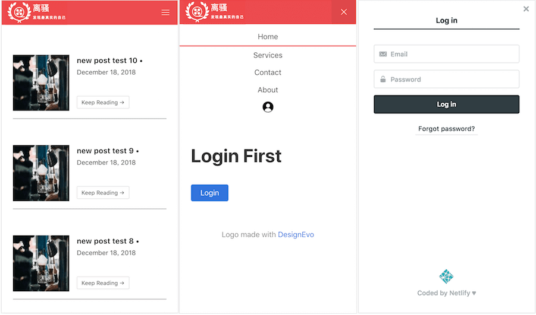

# Gatsby Netlify Identity Starter

**Note:** This starter is based on the [Gatsby + Netlify CMS Starter](https://github.com/netlify-templates/gatsby-starter-netlify-cms).

**But:** Remove the `gatsby-plugin-netlify-cms` and `netlify-cms` dependenicy to disable auto forward to `admin`, 

And, added the `netlify-identity-widget` to perform signup/login/logout.

Demo, is in [HERE](https://inspiring-me-lwz7512.netlify.com/)


## Sceenshots




## Features

* Mobile Screen support
* Privacy control for post content view & profile page
* User authentication by Netlify Identity Widget/Service
* Pagination for posts
* Navigation menu with active status


## Deployment Prerequisites

* Node (I recommend using v8.2.0 or higher) enviroment
* [Gatsby CLI](https://www.gatsbyjs.org/docs/) installed
* A netlify account;
* A site app setup(New site from Git) in [netlify](https://app.netlify.com/);
* `Enable Identity` in site Identity tab page;
* An API endpoint URL needed while locally running;


## Getting Started (Recommended)

Use the button below to build and deploy your own copy of the repository:

<a href="https://app.netlify.com/start/deploy?repository=https://github.com/AustinGreen/gatsby-starter-netlify-cms&amp;stack=cms"></a>

After clicking that button, you’ll authenticate with GitHub and choose a repository name. Netlify will then automatically create a repository in your GitHub account with a copy of the files from the template. Next, it will build and deploy the new site on Netlify, bringing you to the site dashboard when the build is complete. Next, you’ll need to set up Netlify’s Identity service to authorize users to log in to the CMS.

### Develop Locally
```
$ git clone https://github.com/[GITHUB_USERNAME]/[REPO_NAME].git
$ cd [REPO_NAME]
$ yarn
$ yarn develop
```
To test the CMS locally, you'll need run a production build of the site:
```
$ npm run build
$ npm run serve
```

after new .md page added, or modified, commit and push your local changes to remote git repository,
then, netlify will automatically rebuild and publish the site.

**REMEMBER**

FIRST local `$ yarn build` to detect error, THEN commit and push...


## Getting Started (Without Netlify)
```
$ gatsby new [SITE_DIRECTORY_NAME] https://github.com/AustinGreen/gatsby-starter-netlify-cms/
$ cd [SITE_DIRECTORY_NAME]
$ npm run build
$ npm run serve
```

### Still feel complex?

try this [Netlify identity widget demo app](https://github.com/lwz7512/netlify-id-widget-demo) 

